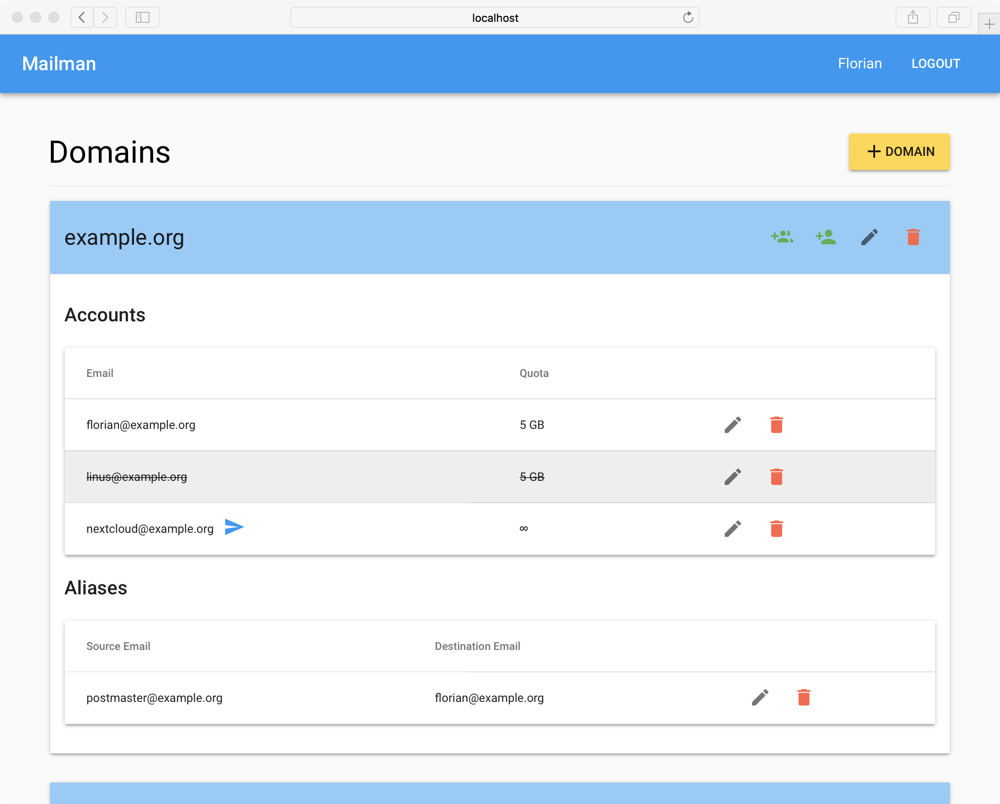

# Mailman

Mailman (eng. Postbote) ist eine webbasierte administrative Oberfläche für den Mailserver. Der Name kann für Mail Manager oder eben Postbote stehen :)



# Voraussetzungen

Mailman wurde speziell für die Administrierung des Mailservers aus dem Tutorial von Thomas Leistner entwickelt:

[Mailserver mit Dovecot, Postfix und MySQL unter Ubuntu 16.04 LTS](https://thomas-leister.de/sicherer-mailserver-dovecot-postfix-virtuellen-benutzern-mysql-ubuntu-server-xenial/)

Bevor Mailman installiert werden kann muss der Mailserver bereits funktionieren und es muss mindestens eine *Domain* und ein *Account* in der Datenbank sein.

# Installation

Zum aktuellen Zeitpunkt gibt es noch kein Tutorial, jedoch kann Mailman wie jede andere Rails- Applikation deployed werden.

Ich verweise zurzeit auf das Tutorial von [GoRails.com](https://gorails.com/deploy/ubuntu/16.04).

# Konfiguration

Nachdem Mailman deployed wurde muss in der `/etc/profile` das Secret und die Admin Email eingetragen werden.

Das Secret kann mit folgenden Kommando im Verzeichnis `/home/deploy/mailman/current/` generiert werden:

`RAILS_ENV=production bundle exec rake secret`

```
# /etc/profile

export SECRET_KEY_BASE=01234556789...
export MAILMAN_ADMIN_EMAIL="admin@example.com"
```
